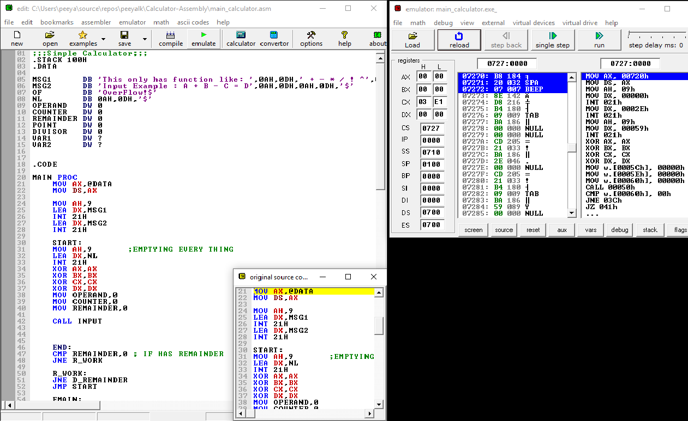
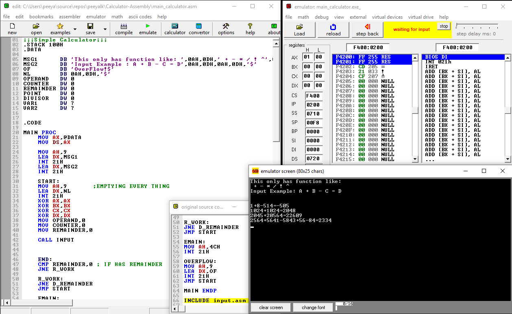
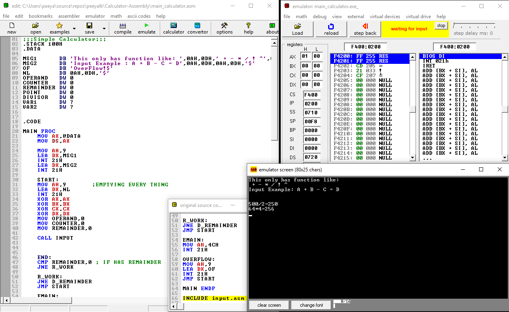
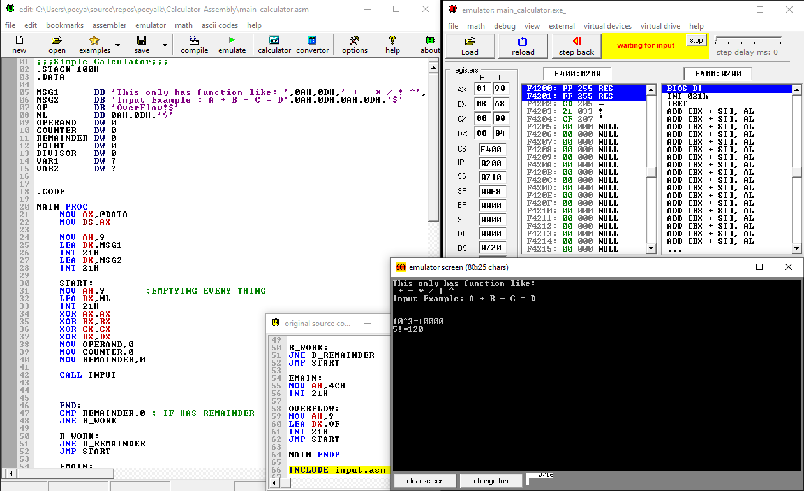

**Basic Calculator - Assembly Language**

**Authors:**

Marlen Ibraimov
Ravshan Khamidov

**Built with:**

- Assembly Language

**Tools:**

- Emu8086

**Requirements**** :**

- Emu8086

**Installation**** :**

- Open "main_calculator.asm" with Emu8086
- Press "Emulate" & then "Run" (Check the Screenshots sections for instructions)
- AND!!! HURRAH!!!! You have ran the software! ENJOY!

#

# Screen Shots:

